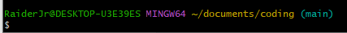
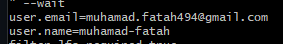
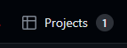

# Latihan membuat landing page dengan html dan css
project ini saya buat untuk melatih kemampuan html, css dan juga git

## Gimana cara memulai kolaborasi?
1. download terlebih dahulu [vscode](https://code.visualstudio.com/download "Install sesuai os yang digunakan")
2. download juga [gitbash](https://git-scm.com/downloads "Install sesuai os yang digunakan") lalu install seperti pada umumnya
3. buka gitbash (bisa dari windows pencarian ketikan saja `gitbash`)
4. abis itu arahin ke folder tempat ingin menyimpan codingan, misalnya `cd documents/coding`.Kalau error coba buat folder di tempat tersebut, pergi ke documents lalu buat folder coding
5. Jika sudah berhasil maka tampilannya akan seperti ini
   
6. kalau sudah seperti itu, ketikan `git clone https://github.com/Muhamad-Fatah/Latihan-LandingPage.git`
7. sebelum lanjut ke step selanjutnya config dulu git nya dengan cara ketik `git config user.email=emailgithubkalian@gmail.com` lalu enter, setelah itu ketik `git config user.name=usernamegithubkalian` lalu enter lagi.Gimana cara cek nya kalau udah berhasil? ketikan `git config --list` nanti akan muncul seperti ini  
8. Ok kalau sudah muncul seperti foto diatas kita lanjut untuk mulai mengoding, pertama chat dulu untuk meminta akses ke project management github.Setelah mendapat akses, buka tab project yang ada di github 
   
9. Setelah dibuka nanti akan ada project dengan nama `Latihan landing page` lalu dibuka dan akan muncul 3 buah card **Todo**,**In Progress** & **Done**
10. Penjelasan singkatnya seperti berikut todo adalah task yang bisa dikerjain, inprogress adalah task yang sedang dikerjain dan done adalah task yang sudah selesai **udah di merge**
11. Kalau sudah paham kita lanjut, pilih satu tugas dari Todo trus ganti assignee nya ke diri sendiri dan pindah task ke In Progress (lalu ikuti codingan yang ada dan pastikan hasilnya sesuai)
12. Selanjutnya push ke github apa yang dikerjain, gimana caranya? pertama buka terminal dengan cara `ctrl + j` (optional: ubah terminal defaultnya ke gitbash, pencet tanda panah disitu trus configure default.Kalau bingung liat di google), abis itu ketik `git add .` **PASTIIN PAKE . (titik)**, lalu kalau udah ketik lagi `git commit -m "pesan yang ingin disampaikan"` tulis aja sesuai apa yang kalian kerjain misalnya `git commit -m "Navbar landing page sudah di design"` **Jangan lupa tanda "" (tanda petik)**, kalau sudah lanjut lagi buat branch baru sesuai yang dikerjain `git branch -M navbar` **Pastiin juga pake -M (M nya M besar)**, kalau udah lanjut lagi step terakhir `git push origin navbar`
13. Kalau udah berhasil push, pas kita buka github di browser trus buka project landing page harusnya udah ada branch tadi trus lakuin pull request.
14. Trus gimana kalau kita liat ada yang update dari branch nya, tapi mau ada di local? caranya `git pull origin main`, otomatis akan narik update terbaru dari repo